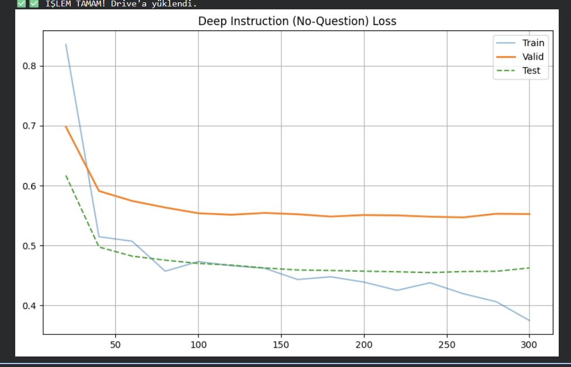

# LoRA Fine-Tuning Project: Deep vs. Diverse Instruction (Qwen2.5-Coder-1.5B-Instruct)

This repository contains LoRA fine-tuning experiments on **Qwen/Qwen2.5-Coder-1.5B-Instruct** with two instruction strategies:
- **Deep Instruction**
- **Diverse Instruction**

Evaluation: **LiveCodeBench (AtCoder Easy, 41 problems)**

---

## Training Loss

### Deep Instruction

- Exact values: `logs/deep/loss_log.json`

### Diverse Instruction

- Exact values: `logs/diverse/loss_log.json`

---

## LiveCodeBench Results (Pass@1)

| Model | Best Checkpoint | Pass@1 | Solved |
|------|------------------|-------:|------:|
| Base Model | - | 19.5% | 8/41 |
| Deep Instruction | step-260 | 29.3% | 12/41 |
| Diverse Instruction | step-620 | 34.1% | 14/41 |

Full outputs:
- `results/livecodebench/summary.json`
- `results/livecodebench/detailed/`
- `results/livecodebench/evaluations/`
- `results/livecodebench/generations/`

---

## Files
- `train.py` : training script
- `eval.py` : evaluation wrapper/info
- `requirements.txt` : dependencies

